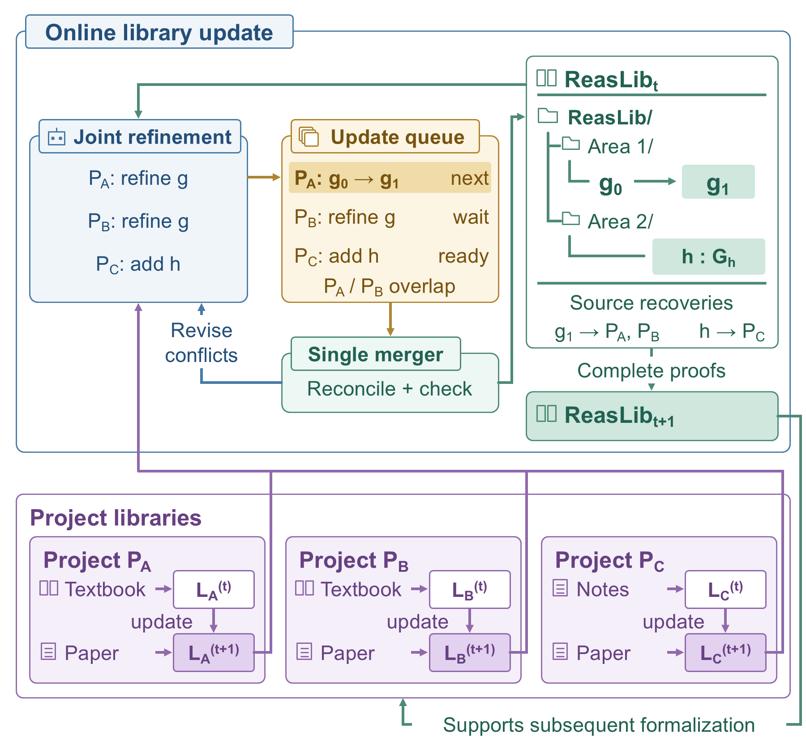
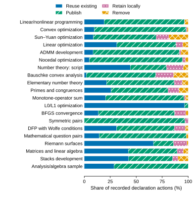

# LIFT

**Library Integration of Formalized Theorems for Reusable Mathematical Knowledge**

[中文](README.zh-CN.md) · [Paper experiments](docs/experiments.md) · [Reproduction](docs/reproducibility.md) · [Mathematical examples](examples/paper-cases/README.md) · [Licenses](LICENSES.md)

LIFT turns formalized mathematical developments into reusable Lean interfaces. It constructs public theorems, definitions, and representation maps together with explicit recoveries of the source specifications. These public mathematical components form **ReasLib**.



## Method

LIFT couples **interface construction** with **source recovery**. A candidate can align with an existing theorem, generalize a source argument, or transport a construction between representations. A recovery then specializes or adapts the interface to the source's full specification, including defining equations and operation laws for constructions.

Multiple producers construct candidates against a library snapshot. A single consumer integrates candidates into the evolving library, returning overlapping candidates for revision when necessary. Source recovery and compatibility checks connect accepted updates to the developments that use them. [Method details](docs/method.md).

## Results and experiments

| Experiment | Paper evidence | Inspect |
| --- | --- | --- |
| Corpus construction | 20 developments; 10,922 catalogue items; 5,061 accepted source-item integrations | [Inputs and tables](experiments/corpus-construction/README.md) |
| Source recovery | 7 linked batches; 249 obligations linked to successful proof tasks; 5 compiled case files and 9 axiom-checked declarations | [Proof links and Lean cases](experiments/source-recovery/README.md) |
| Downstream reuse | One normal-cone interface recovered at radius 1/2 and used by a research proof at radius 12 | [Source, interface, and caller](experiments/downstream-reuse/README.md) |
| Online revision | An accepted congruence interface enters a revised Beck proof; checkpoint covers 20 source declarations and 22 clients | [Snapshots and events](experiments/online-revision/README.md) |



The 15,716 public-module occurrences include inherited and unfinished content. Declaration decisions are counted as actions: 8,854 reuse, 19,253 publication, 2,568 local retention, and 3,283 removal. Proof-task links describe recorded completion; selected Lean cases additionally provide compiler and axiom evidence. Definitions and paper table labels appear in the [experiment guide](docs/experiments.md).

## Quick start

Download the repository from the [paper artifact link](https://anonymous.4open.science/r/LIFT-C5F7/), extract it, and open a terminal at its root. Data checks require Python 3.10 or later:

```bash
python3 scripts/verify_release.py
python3 scripts/verify_artifacts.py
python3 scripts/reproduce_tables.py --check
```

Generate tables and figures:

```bash
python3 scripts/reproduce_tables.py --output _runs/tables
python3 -m pip install -r requirements-plots.txt
python3 scripts/plot_results.py --output _runs/figures
```

Open [demo/index.html](demo/index.html) to explore the catalogue, mathematical cases, and recorded revision offline. Its data is generated from the released tables.

## Executable mathematical examples

| Example | Public interface and use |
| --- | --- |
| First-order optimality | Align the Euclidean source specification with `IsLocalMin.fderiv_eq_zero` |
| Taylor formulas | Specialize general normed-space calculus interfaces to Euclidean coordinates |
| Product fundamental group | Construct `prodMulEquiv` using projection and pairing homomorphisms with inverse laws |
| Normal cone | Apply `DualPairing.maximalMonotone_normalConeGraph_closedBall` through a concrete sequence-space representation |
| Beck revision | Reuse `StrongConvexOn.congr` in the revised squared-norm proof |

The [case guide](examples/paper-cases/README.md) connects each interface to its source application, environment, and audit. Install [Elan](https://github.com/leanprover/elan) and Git, then compile the calculus and topology cases:

```bash
cd examples/paper-cases/reaslib
lake update
lake exe cache get
lake build
lake env lean Audit.lean
```

This project pins Lean 4.32.0 and Mathlib. The audit checks nine named declarations against the standard axiom set. Normal-cone and Beck projects preserve their own dependency pins. [Full reproduction commands](docs/reproducibility.md).

## ReasLib serial demo

[Explore the three-source library](demo/serial.html) · [Build the Lean project](examples/reaslib-serial/README.md) · [Construction records](experiments/serial-library-growth/README.md)

One project grows through Beck, Bauschke–Combettes, and Nesterov, with statement preparation, integration, and proof at each stage. Across six accepted batches, the library contains **180 trusted declarations**, preserves **18 source interfaces** and **51 representation obligations**, and passes **69 fixed source checks**, **25 extension boundary examples**, and the original **21 independent checks**. Its interfaces connect strong convexity, constrained quadratics, differentiable curvature, subgradient monotonicity, and resolvent contraction.

```bash
python3 scripts/check_serial_demo.py --output _runs/reaslib-serial
```

The project guide installs its pinned Lean dependencies. The interactive report shows all six accepted releases, complete declaration types, compiled dependencies, and construction accounting. [Supplementary proof cases](experiments/serial-library-growth/supplementary/README.md) record exact source goals and their actual library use. This executable demo accompanies the paper's ReasLib methodology; its results are recorded separately from the paper experiment tables.

## Tools

- **[Lean → JSON](tools/lean_json/README.md):** extract compiler facts, translate mathematical content, review it against the full formal specification, and revise rejected drafts.
- **[Toolchain alignment](tools/toolchain/README.md):** migrate an isolated project to pinned dependencies, repair diagnosed identifier/import changes, and check original interfaces and clients.

```bash
python3 tools/lean_json/extract.py examples/lean-json --module Fixture --output _runs/fixture-facts.json
```

[Tool validation](experiments/tool-validation/README.md) covers a multi-module fixture on three Lean versions and a Mathlib migration example.

[Component dependencies and installation](docs/dependencies.md) · [ReasLib extension sources](experiments/serial-library-growth/extension-plan.md)

## Repository layout

```text
src/lift_tools/           Independent extraction, translation and migration tools
src/lift_artifacts/       Shared reproduction and validation implementation
scripts/                 Command-line entry points
experiments/             Inputs and results grouped by experimental question
examples/paper-cases/     Paper cases with pinned environments
examples/reaslib-serial/  Three-source evolving ReasLib and independent clients
tools/                   Lean extraction and toolchain-alignment utilities
docs/                    Method, experiment mapping, reproduction, and figures
metadata/                Artifact registry, provenance, and integrity manifest
demo/                    Offline evidence browser
```

Historical records accompany their corresponding result tables. New local runs write to `_runs/`, preserving the released evidence. [Data dictionary](experiments/README.md) · [Validation coverage](docs/validation.md).

## Citation and license

Cite **LIFT: Library Integration of Formalized Theorems for Reusable Mathematical Knowledge** and link to the [paper artifact](https://anonymous.4open.science/r/LIFT-C5F7/).

Original software is under **Apache-2.0**. Original documentation, figures, and curated statistical data are under **CC BY 4.0**. Third-party terms and path-specific exclusions are listed in [LICENSES.md](LICENSES.md).
